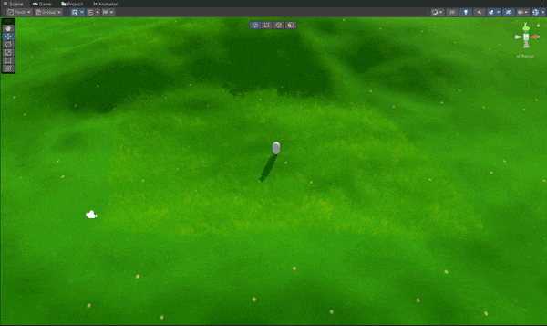
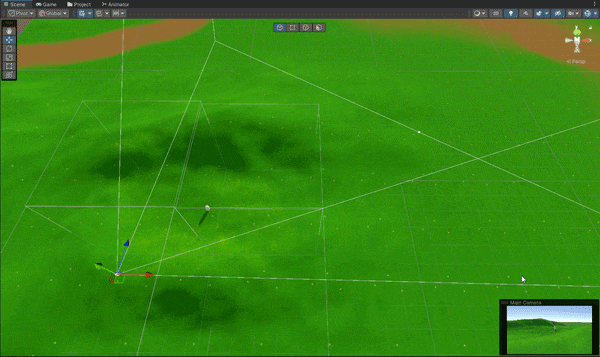
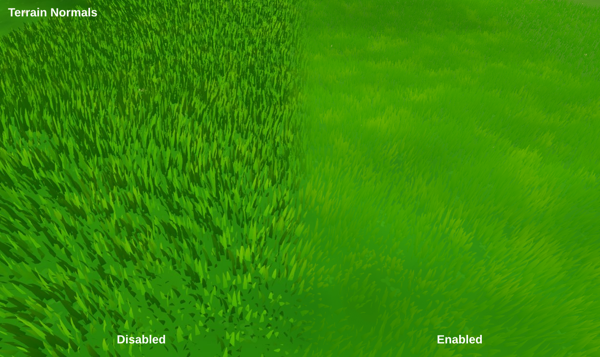

# Terrain GPU Instanced Grass

Grass system made for use with Unity Terrain and the Built-in Rendering Pipeline. Tested and developed on Unity 2022.3.62f3.

## Features

Per-instance frustum and distance culling:



Per-chunk culling:



LOD support:


Override the mesh's normals with terrain normals: 



Other features:
- Grass instances only spawn on specified terrain layer index, with the corresponding channel value from terrain's splat map controlling scale. 
- World-space noise for varying grass colors, blended between 3 color properties.
- Vertex animated with configurable wind settings.

# Installation
> [!note]
> Please install the [Artifice Toolkit](https://github.com/AbZorbaGames/artificetoolkit) dependency first.

Install via Unity's Package Manager using this git URL:

```
https://github.com/cmapua/terraingrass.git
```

# Usage
1. Add terrain to scene with at least one terrain layer.
2. Add `TerrainGrass` component to Terrain GameObject.
3. Supply the following required references:
   - Camera
   - Grass Mesh
4. Grass should start appearing on the terrain, around where the referenced camera is. If not, try clicking on the Refresh button in the TerrainGrass component.
   - If the grass mesh was made using Blender, scale and orientation may be wrong. Try checking `_applyBlenderTransformCorrection` and see if that fixes the issue.

# Resources
- [Daniel Ilett - Six Grass Rendering Techniques in Unity](https://danielilett.com/2022-12-05-tut6-2-six-grass-techniques/)
- [Minions Art - Grass System](https://www.patreon.com/posts/wip-patron-only-83683483)
- [Garrett Gunnell - Grass](https://github.com/GarrettGunnell/Grass)
- [MPC - Unity GPU Culling Experiments](https://www.mpcvfx.com/en/news/unity-gpu-culling-experiments-2/)
- [Kyle Halladay - Getting Started with Compute Shaders in Unity](https://kylehalladay.com/blog/tutorial/2014/06/27/Compute-Shaders-Are-Nifty.html)
- [sapra - Techniques for a Procedural Grass System](https://ensapra.com/2023/05/techniques-for-a-procedural-grass-system)
- [Elvar Orn Unnthorsson - Indirect Rendering with Compute Shaders](https://github.com/ellioman/Indirect-Rendering-With-Compute-Shaders/tree/master)
